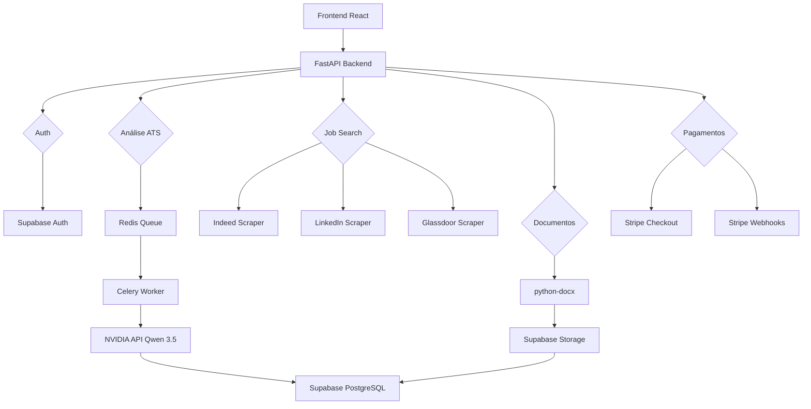

# 🤖 JARVIS CV — AI Career Optimization SaaS

[](https://reactjs.org/)
[](https://fastapi.tiangolo.com/)
[](https://supabase.com/)
[](https://stripe.com/)
[](https://build.nvidia.com/)
[](LICENSE)

> **Plataforma SaaS de otimização de carreira com IA**
>
> *ATS Score + Job Matching + Geração DOCX + Carta de Apresentação + Job Search Multiportal*

---

## 🌟 Features

### 🎯 Análise ATS com IA
- **ATS Score** —Pontuação de compatibilidade com vagas
- **Gap Analysis** — Skills faltantes identificadas
- **Reescrita de Resumo** — Summary otimizado automaticamente
- **Headline Sugerida** — Título profissional impactante
- **Recomendações** — actionable feedback

### 💼 Job Search
- **9 Portais** — Indeed, LinkedIn, Glassdoor, Gulf Talent, Bayt, etc.
- **Scraping Ético** — Playwright + BeautifulSoup
- **Filtros Avançados** — Cargo, localização, remoto, salário
- **Auto-Apply** — Preenchimento assistido (ELITE)

### 📄 Documentos Premium
- **Export DOCX** — Templates ATS-friendly
- **Currículo Otimizado** — Reformulado com IA
- **Carta de Apresentação** — Personalizada por vaga (ELITE)
- **Estratégia Semanal** — Plano de ação (ELITE)

### 💳 Monetização
- **3 Planos** — FREE, PRO (R$49), ELITE (R$149)
- **Stripe Integration** — Checkout + Webhooks
- **Usage Tracking** — Limites por plano
- **Portal do Assinante** — Gestão de assinatura

---

## 🏗️ Arquitetura



### Estrutura de Pastas

```
JARVIS CV/
├── web/                        # Frontend React + Vite
│   ├── src/
│   │   ├── components/
│   │   │   ├── layout/         # Navbar, Footer
│   │   │   ├── home/           # Landing page
│   │   │   ├── auth/           # Login, Register
│   │   │   ├── dashboard/      # Dashboard principal
│   │   │   ├── analysis/       # Upload, ATS Results
│   │   │   ├── jobs/           # Job search
│   │   │   └── documents/      # DOCX export
│   │   ├── hooks/              # Custom hooks
│   │   ├── services/           # API clients
│   │   └── pages/              # Rotas
│   └── package.json
│
├── api/                        # Backend FastAPI
│   ├── app/
│   │   ├── main.py             # Entry point
│   │   ├── config.py           # Env vars
│   │   ├── routers/            # Endpoints
│   │   │   ├── auth.py
│   │   │   ├── resumes.py
│   │   │   ├── analysis.py
│   │   │   ├── jobs.py
│   │   │   ├── documents.py
│   │   │   └── payments.py
│   │   ├── services/           # Business logic
│   │   │   ├── ai_engine.py
│   │   │   ├── ats_analyzer.py
│   │   │   ├── docx_generator.py
│   │   │   └── stripe_service.py
│   │   └── workers/            # Celery tasks
│   └── requirements.txt
│
├── supabase/
│   ├── functions/              # Edge Functions (Deno)
│   └── migrations/             # SQL migrations
│       ├── 001_init_saas_architecture.sql
│       ├── 002_saas_plans_subscriptions.sql
│       └── 003_update_optimization_results.sql
│
└── README.md                   # Este arquivo
```

---

## 🚀 Quick Start

### Pré-requisitos

- Node.js 18+ (frontend)
- Python 3.11+ (backend)
- Supabase account
- NVIDIA API key
- Stripe account (produção)

### 1. Clone o Repositório

```bash
git clone https://github.com/silvano/jarvis-cv-saas.git
cd jarvis-cv-saas
```

### 2. Setup do Backend

```bash
cd api

# Instale dependências
pip install -r requirements.txt

# Copie env template
cp .env.example .env

# Edite .env com suas chaves
# SUPABASE_URL, SUPABASE_KEY, NVIDIA_API_KEY, STRIPE_SECRET_KEY
```

### 3. Setup do Frontend

```bash
cd web

# Instale dependências
npm install

# Copy env template
cp .env.example .env

# Edit with API URL
VITE_API_URL=http://localhost:8000
```

### 4. Execute

```bash
# Terminal 1: Backend
cd api
uvicorn app.main:app --reload

# Terminal 2: Frontend
cd web
npm run dev

# Acesse: http://localhost:5173
```

---

## 📊 Análise ATS

### Como Funciona

1. **Upload do currículo** (PDF/DOCX/TXT)
2. **Extração de texto** — Parse automático
3. **Input da vaga** — Cola descrição ou busca
4. **Verificação de créditos** — FREE: 3/dia, PRO: 15, ELITE: ∞
5. **Análise IA** — NVIDIA Qwen 3.5 122B
6. **Resultado** — Score + gaps + recomendações

### Prompt da IA

```python
# api/app/services/ai_engine.py
PROMPT_ATS = """
Você é especialista em ATS (Applicant Tracking Systems).
Analise este currículo vs. descrição da vaga:

CURRÍCULO:
{resume_text}

VAGA:
{job_description}

Retorne JSON:
{{
  "ats_score": 0-100,
  "strengths": ["skill1", "skill2"],
  "weaknesses": ["gap1", "gap2"],
  "missing_skills": ["skill3"],
  "rewritten_summary": "...",
  "suggested_headline": "...",
  "recommendations": [
    {{"priority": "high", "action": "..."}}
  ]
}}
"""
```

### Exemplo de Resultado

```json
{
  "ats_score": 78,
  "strengths": ["Python", "React", "AWS"],
  "weaknesses": ["Falta Kubernetes", "Sem experiência com Terraform"],
  "missing_skills": ["Kubernetes", "Terraform", "CI/CD"],
  "rewritten_summary": "Engenheiro de Software com 5+ anos em cloud...",
  "suggested_headline": "Senior Software Engineer | Cloud & Infrastructure",
  "recommendations": [
    {
      "priority": "high",
      "action": "Adicione experiência com Kubernetes no resumo"
    }
  ]
}
```

---

## 💳 Planos e Limites

| Feature | FREE | PRO | ELITE |
|---------|------|-----|-------|
| **Análises ATS/dia** | 3 | 15 | Ilimitado |
| **Busca de vagas/dia** | 3 | 15 | Ilimitado |
| **Export DOCX** | ✗ | ✔ | ✔ |
| **Carta de Apresentação** | ✗ | ✗ | ✔ |
| **Estratégia Semanal** | ✗ | ✗ | ✔ |
| **Auto-Apply** | ✗ | ✗ | ✔ |
| **Suporte** | Comunidade | Email | Prioritário |
| **Preço (BRL/mês)** | R$0 | R$49 | R$149 |

---

## 🗄️ Banco de Dados

### Tabelas Principais

```sql
-- Perfis de usuários
profiles (
  id, auth_id, email, full_name, plan,
  daily_analyses_used, daily_jobs_used,
  usage_reset_at
)

-- Currículos
resumes (
  id, user_id, file_url, file_type,
  raw_text, content, version_number, is_active
)

-- Vagas alvo
target_jobs (
  id, user_id, title, company, description,
  source, location, salary_range
)

-- Resultados de análise
optimization_results (
  id, user_id, resume_id, job_id,
  ats_score, strengths, weaknesses,
  missing_skills, rewritten_summary, recommendations
)

-- Assinaturas
subscriptions (
  id, user_id, stripe_customer_id,
  stripe_subscription_id, plan, status
)
```

### RLS (Row Level Security)

```sql
-- Cada usuário acessa apenas seus dados
CREATE POLICY "user_own_resumes" ON resumes
  FOR ALL USING (auth.uid() = (
    SELECT auth_id FROM profiles WHERE id = resumes.user_id
  ));
```

---

## 🔌 APIs

### Backend Endpoints

| Método | Rota | Descrição |
|--------|------|-----------|
| POST | `/api/auth/register` | Cadastro |
| POST | `/api/auth/login` | Login JWT |
| POST | `/api/resumes/upload` | Upload currículo |
| POST | `/api/analysis/` | Análise ATS |
| POST | `/api/jobs/search` | Busca vagas |
| POST | `/api/documents/download` | Download DOCX |
| POST | `/api/payments/checkout` | Stripe Checkout |

### NVIDIA API

```python
import aiohttp

async def analyze_with_nvidia(resume_text, job_description):
    url = "https://integrate.api.nvidia.com/v1/chat/completions"
    headers = {"Authorization": f"Bearer {NVIDIA_API_KEY}"}
    
    payload = {
        "model": "qwen/qwen3.5-122b-a10b",
        "messages": [
            {"role": "user", "content": PROMPT_ATS.format(
                resume_text=resume_text,
                job_description=job_description
            )}
        ],
        "temperature": 0.3,
        "max_tokens": 8192
    }
    
    async with aiohttp.ClientSession() as session:
        async with session.post(url, json=payload, headers=headers) as resp:
            return await resp.json()
```

---

## 📄 Geração DOCX

```python
# api/app/services/docx_generator.py
from docx import Document
from docx.shared import Pt, RGBColor

def generate_optimized_resume(analysis):
    doc = Document()
    
    # Header
    header = doc.add_heading('Currículo Otimizado', 0)
    
    # Resumo reescrito
    doc.add_heading('Resumo Profissional', level=1)
    doc.add_paragraph(analysis['rewritten_summary'])
    
    # Skills destacadas
    doc.add_heading('Competências', level=1)
    for skill in analysis['strengths']:
        p = doc.add_paragraph(skill, style='List Bullet')
        p.runs[0].bold = True
    
    # Salvar no Supabase Storage
    buffer = BytesIO()
    doc.save(buffer)
    buffer.seek(0)
    
    return supabase.storage.from_('resumes').upload(
        file=buffer.getvalue(),
        path=f"optimized/{user_id}/{resume_id}.docx"
    )
```

---

## 🔒 Segurança LGPD

### Compliance

1. **Minimização** — Apenas dados necessários
2. **Consentimento** — Checkbox obrigatório
3. **Portabilidade** — Export via API
4. **Eliminação** — Delete total em 72h
5. **Criptografia** — HTTPS + pgcrypto
6. **Logs anonimizados** — Após 90 dias

### Endpoints LGPD

```python
# Exportação de dados
GET /api/account/export
# Retorna JSON com todos os dados do usuário

# Exclusão total
DELETE /api/account/
# Remove perfil, currículos, vagas, análises, arquivos
```

---

## 🚀 Deploy

### Frontend (Vercel)

```bash
cd web

# Instale Vercel CLI
npm i -g vercel

# Deploy
vercel --prod
```

### Backend (Railway)

```bash
cd api

# Instale Railway CLI
npm i -g @railway/cli

# Deploy
railway login
railway init
railway up
```

### Variáveis de Ambiente

```bash
# Backend
SUPABASE_URL=https://xxx.supabase.co
SUPABASE_KEY=eyJ...
NVIDIA_API_KEY=nvapi-xxx
STRIPE_SECRET_KEY=sk_live_xxx
REDIS_URL=redis://localhost:6379

# Frontend
VITE_API_URL=https://api.jarviscv.dev
VITE_SUPABASE_URL=https://xxx.supabase.co
VITE_SUPABASE_ANON_KEY=eyJ...
```

---

## 📊 Métricas Alvo

| Métrica | Valor |
|---------|-------|
| First Contentful Paint | < 1.5s |
| API Response (cache) | < 50ms |
| Análise ATS | < 15s |
| Geração DOCX | < 5s |
| Busca de vagas | < 10s |

---

## 🛠️ Desenvolvimento

### Adicionar Novo Portal de Vagas

```python
# api/app/services/job_scraper.py
class IndeedScraper(BaseScraper):
    async def search(self, query, location):
        # Implement scraping logic
        return jobs
```

### Adicionar Novo Plano

```sql
-- migrations/004_add_enterprise_plan.sql
ALTER TABLE profiles 
  ALTER COLUMN plan SET CHECK (plan IN ('free', 'pro', 'elite', 'enterprise'));

ALTER TABLE subscriptions
  ALTER COLUMN plan SET CHECK (plan IN ('free', 'pro', 'elite', 'enterprise'));
```

---

## 🤝 Contribuindo

Contribuições são bem-vindas! Áreas de interesse:

- [ ] Novo portal de vagas (Categoria, Livre, etc.)
- [ ] Templates DOCX adicionais
- [ ] Multi-idioma (EN + ES)
- [ ] Chrome Extension para auto-apply
- [ ] Mobile app (React Native)

---

## 📚 Recursos

### Documentação Oficial
- [FastAPI Docs](https://fastapi.tiangolo.com/)
- [Supabase Docs](https://supabase.com/docs)
- [Stripe Docs](https://stripe.com/docs)
- [NVIDIA API](https://build.nvidia.com/)

### Projetos Relacionados
- [POWER BI](../POWER%20BI/) — Dashboard Logística
- [CYBERFLUX](../CYBERFLUX/) — AI Skills

---

## 📄 Licença

MIT License — livre para uso pessoal e comercial.

---

## 📞 Contato

**Silvano Moraes** — Solution Developer

- **GitHub:** github.com/silvano
- **LinkedIn:** linkedin.com/in/silvano-moraes-de-souza
- **Email:** silvano@antigravity.dev

---

<div align="center">

**Criado com ❤️ por Silvano Moraes**

*JARVIS CV — Sua carreira, otimizada por IA.*

[⬆ Topo](#-jarvis-cv--ai-career-optimization-saas)

</div>