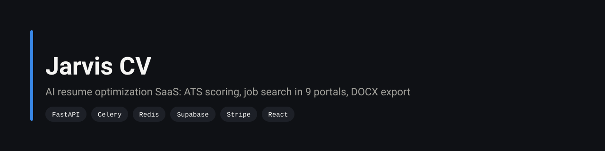
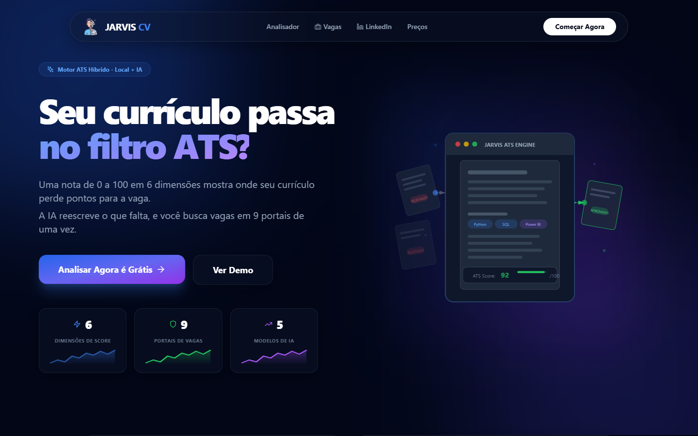
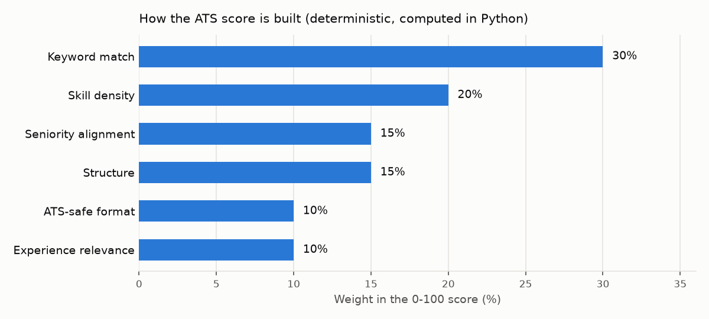
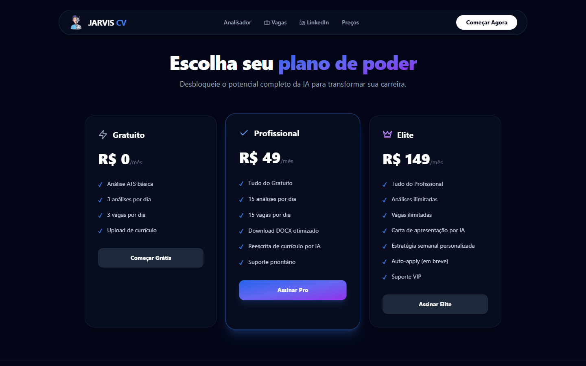
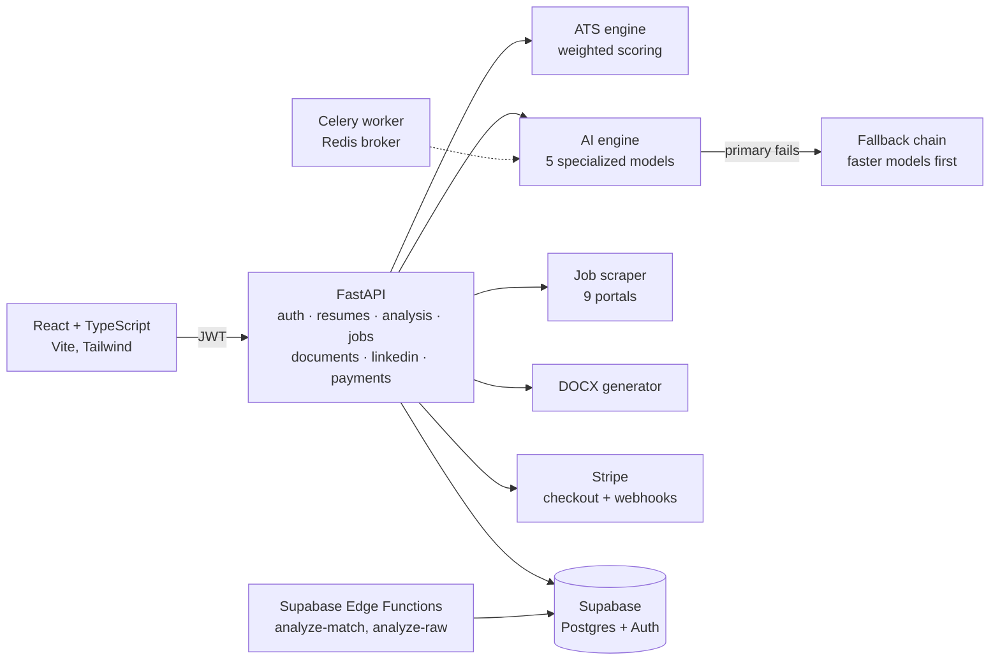

<p align="center">
  
</p>

<p align="center">
  
  
  
  
  
  
</p>

> A SaaS that reads your resume and a job posting, tells you how an ATS will score the match and why, rewrites what is missing, searches 9 Brazilian job portals, and exports the result as a DOCX. Built end to end: API, AI layer, database, payments and frontend.



## Features

| | |
|---|---|
| ATS score | A deterministic score from 0 to 100, built from six weighted parts: keyword match 30%, skill density 20%, structure 15%, seniority alignment 15%, experience relevance 10%, ATS-safe formatting 10% |
| AI rewrite | Gap analysis, rewritten summary, suggested headline and recommendations, produced by LLMs on NVIDIA NIM |
| Job search | One query across Indeed BR, Catho, LinkedIn, Gupy, Remotar, GeekHunter, ProgramaThor, Nerdin and InfoJobs, with remote, hybrid and radius filters |
| Documents | ATS-friendly DOCX resume and cover letter generated with `python-docx` |
| LinkedIn audit | Extracts a profile and suggests improvements |
| Plans | Free, Pro (R$ 49) and Elite (R$ 149) with daily usage limits, Stripe Checkout and webhooks |



<sub>Read from `ats_weights` in <a href="api/app/config.py">api/app/config.py</a> by <a href="scripts/chart_ats_weights.py">scripts/chart_ats_weights.py</a>, so the chart changes if the weights do.</sub>

<details>
<summary>Pricing page (plans and daily limits enforced by the API)</summary>



</details>

## Architecture



The AI layer does not depend on one model. Each task goes to a specialist: a "brain" for reasoning (Llama 3.1 8B), a "writer" for rewriting (Qwen 2.5 Coder 32B), an "analyzer" (Gemma 3 27B), a "planner" (Mistral 7B) and a "fast" model (Nemotron Mini 4B). A call retries once, then walks a fallback chain ordered by speed, so a slow or unavailable model degrades the answer instead of failing the request.

The ATS score is computed in plain Python, not by an LLM. The same resume and job always get the same number, and each component can be explained to the user.

## Project structure

```
api/app/
  routers/       auth, resumes, analysis, jobs, documents, linkedin, payments, health
  services/      ai_engine, ats_engine, resume_parser, extractor, job_scraper,
                 docx_generator, linkedin_optimizer
  workers/       Celery tasks (ATS analysis, cover letter)
supabase/
  migrations/    schema, plans and subscriptions, results
  functions/     Edge Functions (Deno)
web/src/         React app: landing, auth, dashboard, match result, jobs, LinkedIn audit, pricing
```

About 7,400 lines of Python, TypeScript and SQL.

## Run it

```bash
# API
cd api
python -m venv .venv && source .venv/bin/activate
pip install -r requirements.txt
cp .env.example .env        # Supabase, NVIDIA and Stripe keys
python run.py               # http://localhost:3001/docs

# Web
cd ../web
npm install
npm run dev                 # http://localhost:5173
```

## Engineering decisions

| Decision | Why |
|---|---|
| Deterministic ATS score, LLM only for text | Users compare scores across edits. A score that moves because the model sampled differently would be useless. |
| Several small models with a fallback chain | Free and low-cost endpoints are rate limited and sometimes down. Routing by task and falling back keeps the product usable. |
| Supabase for auth and Postgres | Auth, row-level security and a hosted database without running them myself, leaving time for the product logic. |
| Stripe webhooks as the source of truth for plans | The plan changes only when Stripe confirms the payment, not when the browser says checkout finished. |

## Limitations

- The Celery tasks are defined, but the API routes still run the analysis inside the request. Moving them to the queue is the next step.
- No automated test suite yet; QA so far has been manual.
- Job search depends on the HTML of each portal and breaks when a portal changes its layout.

## Author

**Silvano Moraes de Souza**, Software Engineer · Python, APIs, automation and data in production
[LinkedIn](https://www.linkedin.com/in/silvano-moraes-de-souza) · [Portfolio](https://silvanomsouza.vercel.app/) · [GitHub](https://github.com/silvano-moraes-de-souza)
